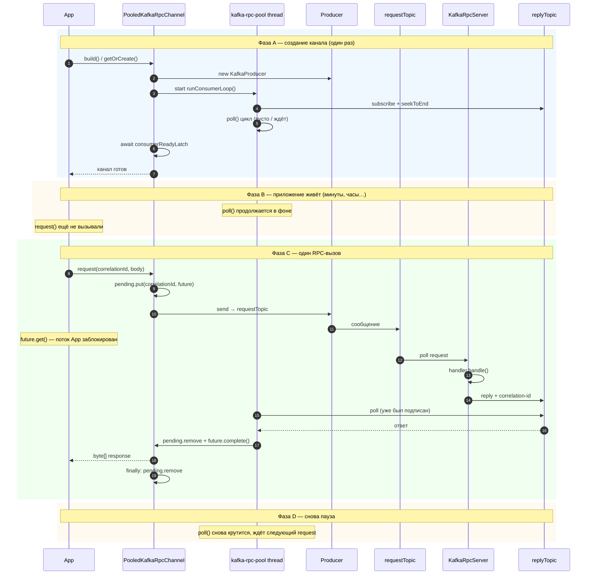

# Ось времени: `PooledKafkaRpcChannel` — `build()` → пауза → `request()` → ответ

Consumer на **reply**-топик **не** стартует вместе с `request()`. Он поднимается при создании канала и между вызовами `request()` продолжает `poll()` в фоне.

## Диаграмма последовательности по фазам



## Линейная шкала времени

```
время ──────────────────────────────────────────────────────────────►

│◄── build() ──►│◄────────── пауза (нет request) ──────────►│◄─ request() ─►│◄─ пауза ─►
                │                                            │               │
  PoolThread:   [subscribe replyTopic][poll][poll][poll]...[poll][poll][poll][poll]...
  App:         [ждёт latch]          [работает]              [get блок]     [работает]
                                            ↑                  ↑       ↑
                                            │                  │       └─ future.complete → return
                                            │                  └─ producer.send → server → reply
                                            └─ consumer УЖЕ слушает replyTopic
```

## Два потока в фазе C (не два «запуска» consumer)

```
Поток App (Caller)              Поток kafka-rpc-pool-0
────────────────────            ─────────────────────────
request()
  pending.put
  producer.send ──────────────► Kafka requestTopic
  future.get()  ████████████   poll() … poll() …
  (блокировка)  ████████████       │
                ████████████       ▼
                ████████████   reply в replyTopic
                ████████████   future.complete()
  return bytes  ◄──────────────
  finally remove
```

## Итог

| Вопрос | Ответ |
|--------|--------|
| Consumer стартует при `request()`? | **Нет** |
| Когда стартует? | При `new` / `build()` канала (фаза A) |
| Что делает `request()` с consumer? | **Ничего** — только `pending` + `send` + `get` |
| Параллельно с send на сервер? | Consumer **уже** poll'ит reply-топик; send и poll — разные топики |

## Ссылки на код

- Запуск consumer-потоков: `PooledKafkaRpcChannel` конструктор, цикл `runConsumerLoop` — [`PooledKafkaRpcChannel.java`](../kafka-rpc-runtime/src/main/java/ru/sbrf/uamc/kafkarpc/PooledKafkaRpcChannel.java)
- Синхронный вызов: метод `request(String, byte[], Map)`
